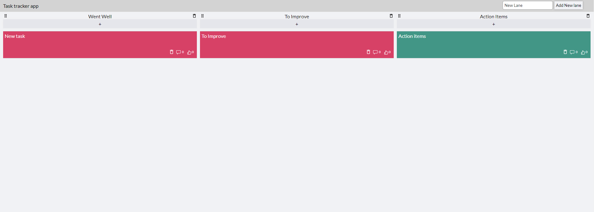

# Task tracker app

This project was bootstrapped with [Create React App](https://github.com/facebook/create-react-app).

# Latest update

Add new lane and delete lane feature added

## How it looks ?

| Home Page                       |
|---------------------------------|
| |

## Functionality

For now you can only add tasks in 3 columns, and all the data is store in the `localstorag` only. You can like the task, edit and delete.

## Available Scripts

In the project directory, you can run:

### `npm i`

To Install the npm packages
### `npm start`

Runs the app in the development mode.\
Open [http://localhost:3000](http://localhost:3000) to view it in the browser.

The page will reload if you make edits.\
You will also see any lint errors in the console.

### `npm test`

Launches the test runner in the interactive watch mode.\
See the section about [running tests](https://facebook.github.io/create-react-app/docs/running-tests) for more information.

### `Tech Used`
1. ReactJS.
2. Redux.
3. React testing lib.
4. TypeScript.
5. SCSS.
